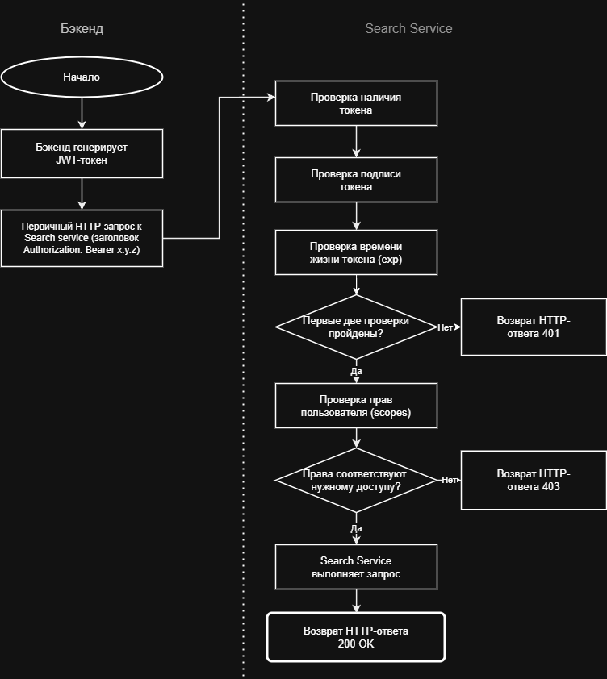

#  Анализ вариантов авторизации для вызовов Search Service из основного backend.

### Цель:
Цель данного RFC - провести сравнительный анализ возможных механизмов авторизации для вызовов Search Service из основного backend, оценить их с точки зрения безопасности, производительности, сложности внедрения и сопровождения, а также выбрать рекомендуемый подход, который станет стандартом для взаимодействия сервисов в рамках платформы.

### контекст:
В настоящее время основной backend взаимодействует с Search Service напрямую по REST API. Механизм сквозной авторизации для межсервисных запросов отсутствует. Единственный существующий механизм защиты - middleware `origin_guard_mw`, которое проверяет значения заголовков `Host`, `Origin` и `Referer` на соответствие спискам разрешённых источников (`ALLOWED_HOSTS`, `ALLOWED_ORIGINS`).
Такой подход может быть достаточным для ограничения запросов, поступающих из браузера, однако не обеспечивает надёжную защиту при взаимодействии между сервисами. Указанные HTTP-заголовки могут быть сформированы или изменены клиентом, поэтому их проверка не может рассматриваться как механизм аутентификации.
С учётом дальнейшего развития системы, появления новых сервисов и интеграций, целесообразно внедрить полноценный механизм аутентификации и авторизации межсервисных запросов, соответствующий современным требованиям безопасности.

### Требования к будущему решению:
#### Выбранный механизм авторизации должен удовлетворять следующим требованиям:
* Надежная аутентификация.
* Автономная проверка.
* Минимальный оверхед.
* Совместимость с FastAPI.

### Сравнения возможных решений:
| Вариант                         | Безопасность  | Сложность внедрения | Плюсы                                                                                                                           | Минусы                                                                             |
| ------------------------------- |---------------| ------------------- | ------------------------------------------------------------------------------------------------------------------------------- | ---------------------------------------------------------------------------------- |
| **Authorization: Bearer Token** | Высокая       | Средняя             | Современный подход, поддерживает срок жизни токенов и разграничение доступа                                                     | Требуется механизм выпуска и проверки токенов                                      |
| **X-API-Key**                   | Средняя       | Низкая              | Простая реализация, минимальные изменения                                                                                       | Статический ключ, необходима ротация, ограниченные возможности управления доступом |
| **Basic Authentication**        | Низкая        | Низкая              | Очень простая реализация                                                                                                        | Передача логина и пароля в каждом запросе, устаревший подход                       |
| **JWT от Backend**              | Очень высокая | Средняя             | Высокая безопасность, возможность передавать информацию о сервисе, не требует запроса к серверу авторизации при каждой проверке | Необходимо реализовать выпуск и проверку JWT                                       |
| **mTLS**                        | Очень высокая | Высокая             | Максимальная защита и взаимная аутентификация сервисов                                                                          | Сложная настройка и сопровождение сертификатов                                     |

### Предлагаемое решение
В качестве механизма авторизации запросов между основным Backend и Search Service предлагается использовать JWT.
Основной Backend формирует и подписывает JWT, содержащий информацию о вызывающем сервисе. При обращении к Search Service токен передается в заголовке:
Search Service выполняет проверку подписи и срока действия токена, после чего принимает решение о предоставлении доступа к запрашиваемому ресурсу.

### Альтернативы
#### Рассмотренные альтернативы (X-API-Key, Basic Authentication и mTLS) имеют следующие ограничения:
* X-API-Key - Ключ статический. Если его кто-то перехватит, злоумышленник получит полный доступ. Кроме того, через один ключ сложно гибко настроить разные права доступа.
* Basic Authentication - считается устаревшим механизмом для межсервисного взаимодействия и не рекомендуется для новых проектов.
* mTLS - Слишком сложен в поддержке. Нужно разворачивать целую систему, чтобы выпускать, безопасно хранить и постоянно обновлять эти сертификаты. Для текущих задач нашего проекта это избыточно.

Таким образом, использование JWT обеспечивает оптимальный баланс между безопасностью, простотой интеграции и дальнейшей масштабируемостью решения.

###  Последствия внедрения решения
#### Положительные:
* Исключается несанкционированный доступ к операциям, таким как /catalogs/upload-many.
* Появляется возможность настраивать точечные права доступа. Например, одному сервису можно разрешить только проверять, работает ли система, а админ-сервису - массово удалять каталоги.
 
#### Отрицательные / Риски:
* Токен работает автоматически до тех пор, пока не закончится его срок. Если злоумышленник украдет секретный ключ системы, он сможет беспрепятственно совершать любые действия от имени пользователей. Этот доступ закроется только после того, как мы вручную поменяем секретный ключ на сервере.
* Благодаря кэшированию токена на стороне Backend, риск «Проверка подписи JWT создает небольшую вычислительную нагрузку на CPU» минимизируется для отправляющей стороны (Backend делает это раз в 9-10 минут, а не на каждый из 10 000 запросов). Нагрузка останется только на стороне Search Service, который проверяет подпись входящих запросов.

### Минимизация рисков
* Установить минимальное время жизни токена (~10 минут).
* Убрать секретные ключи из исходного кода и хранить их в защищенном месте, а приложение будет получать их через переменные окружения при запуске.
* Провести нагрузочное тестирование перед внедрением.
* Асинхронное шифрование: Перейти на алгоритм RS256/EdDSA, чтобы изолировать приватный ключ на стороне Backend.

### Принцип работы предлагаемого решения

#### Более подробно:
1. Получение токена Бэкендом: Перед отправкой запроса Бэкенд проверяет локальный кэш. Если валидный токен с не истекшим сроком действия уже есть в памяти, используется он. Если токена нет или до его истечения осталось менее 1 минуты, Бэкенд генерирует новый JWT-токен (время жизни - 10 минут), подписывает его секретным ключом и обновляет кэш.
2. Отправка запроса: Бэкенд отправляет HTTP-запрос в Search Service и прикрепляет токен в заголовок Authorization: Bearer <токен>.
3. Search Service проверяет токен: Специальный скрипт на стороне Search Service перехватывает запрос и по очереди проверяет:
* Есть ли вообще токен в заголовке? (Если нет - ошибка 401). 
* Цела ли подпись и правильный ли ключ? (Если токен подделан - ошибка 401).
* Не истекли ли 10 минут? (Если просрочен - ошибка 401). 
* Есть ли у Бэкенда права на это действие? (Если прав нет - ошибка 403).
4. Выполнение: Если все проверки пройдены, Search Service выполняет запрос и возвращает успешный ответ 200 OK.

### План реализации
